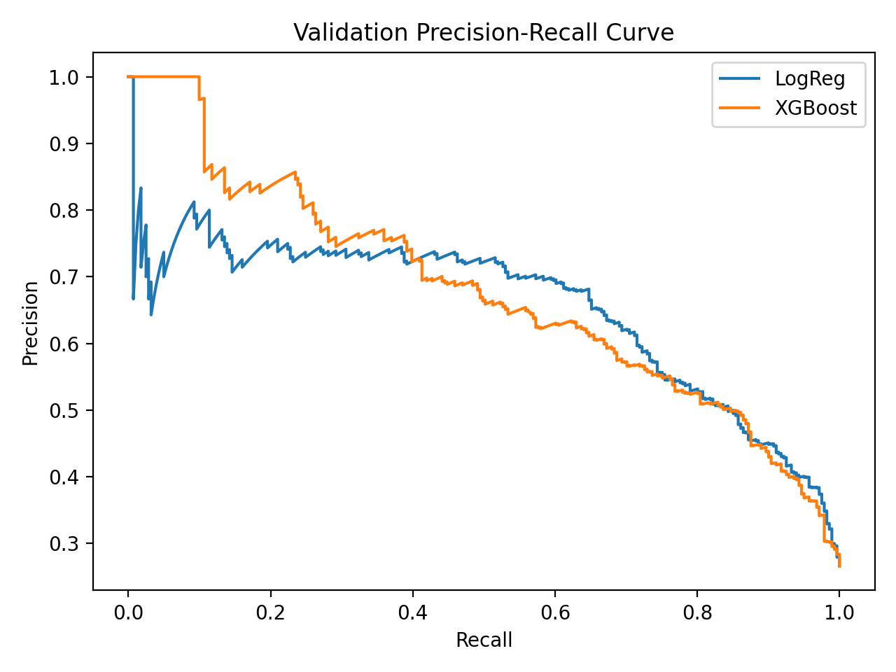
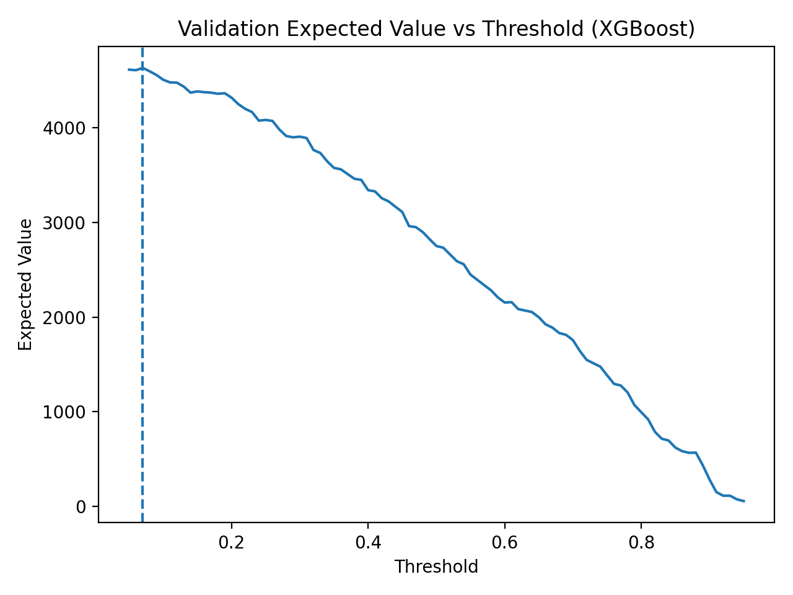
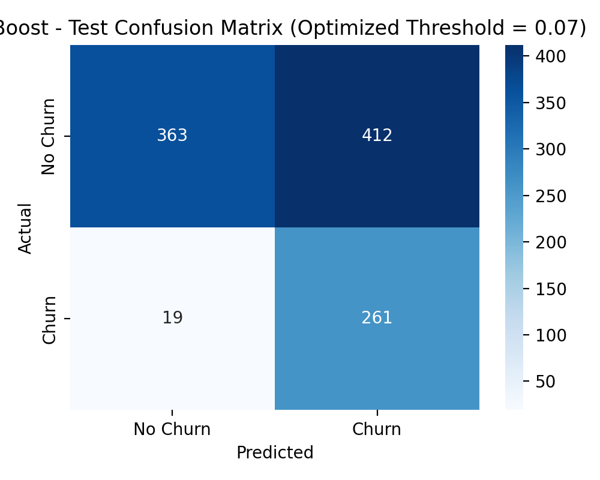
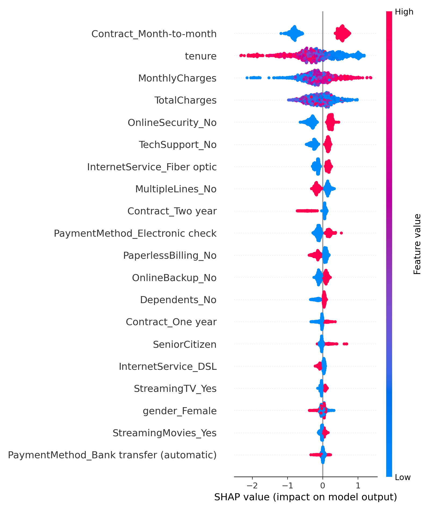

# 📈 Customer Churn Prediction – Business-Aware ML Pipeline

An end-to-end machine learning system for **customer churn prediction**, designed to optimize **business value under class imbalance**, not just maximize accuracy.

This project demonstrates practical ML engineering skills including:

- Structured train/validation/test evaluation
- Baseline vs boosted model comparison
- Precision–Recall analysis under imbalance
- Cost-sensitive threshold optimization
- Confusion matrix tradeoff interpretation
- SHAP-based model explainability
- Deployment-ready FastAPI inference API

---

## 🚀 Problem Framing

Churn prediction is not simply a classification task — it is a **decision optimization problem**.

Rather than using a default threshold (0.50), this system optimizes:

> Expected Retention Value = (True Positives × Retention Value) − (Contact Cost × Customers Contacted)

Assumptions:
- Cost to contact a customer = $1  
- Value of retaining a churner = $20  

This reframes modeling from accuracy-focused to **ROI-focused decision-making**.

---

## 📊 Model Comparison

Two models were trained using a fully pipelined preprocessing architecture:

| Model | Validation ROC-AUC | Validation PR-AUC |
|--------|------------------|-------------------|
| Logistic Regression | ~0.85 | ~0.65 |
| XGBoost | ~0.84 | **~0.68** |

Although Logistic Regression slightly outperformed on ROC-AUC, XGBoost achieved higher PR-AUC, making it more suitable for imbalanced churn detection.

---

## 📉 Precision–Recall Analysis

<p align="center">
  
</p>

**Key Insight:**
- PR curve separation confirms XGBoost maintains stronger precision at higher recall levels.
- In imbalanced settings, PR-AUC is more informative than ROC-AUC.

This justifies selecting XGBoost as the final model.

---

## 💼 Business-Aware Threshold Optimization

Instead of default threshold 0.50, the model was tuned to maximize expected retention value.

Optimal threshold (validation): **0.07**

<p align="center">
  
</p>

### Why 0.07?

- Lower threshold increases recall of churners
- False positives increase — but contact cost is small
- Expected value is maximized at this operating point

This reflects a realistic business tradeoff: prioritize churn capture over overall accuracy.

---

## 📈 Final Test Performance (XGBoost @ Optimized Threshold)

**Probability Metrics**
- ROC-AUC ≈ 0.81  
- PR-AUC ≈ 0.59  

**Thresholded Metrics (0.07)**
- Recall (Churn) ≈ 93%
- Precision (Churn) ≈ 39%
- Accuracy ≈ 59%

---

## 🔍 Confusion Matrix Comparison

### XGBoost @ Optimized Threshold

<p align="center">
  
</p>

### Interpretation

- 93% of churners are captured.
- False positives increase intentionally.
- Overall accuracy decreases — but expected business value increases.

This demonstrates understanding that:

> Accuracy is not the objective — value optimization is.

---

## 🧠 Model Explainability (SHAP)

<p align="center">
  
</p>

Top drivers of churn:

- Month-to-month contracts
- Low tenure
- High monthly charges
- No tech support / security

These findings align with intuitive retention risk factors and provide actionable business insights.

---

## 🏗 Engineering Decisions

- Used sklearn Pipelines to ensure reproducibility.
- Ensured preprocessing is embedded in saved models.
- Evaluated using validation set before final test.
- Saved optimized threshold separately.
- Built deployment-ready FastAPI service.

---

## 🌐 API Deployment

The model is exposed via FastAPI:

```bash
uvicorn main:app --reload
```

# 👤 Author

Arunark Singh

Machine Learning | Data Science | Robotics
